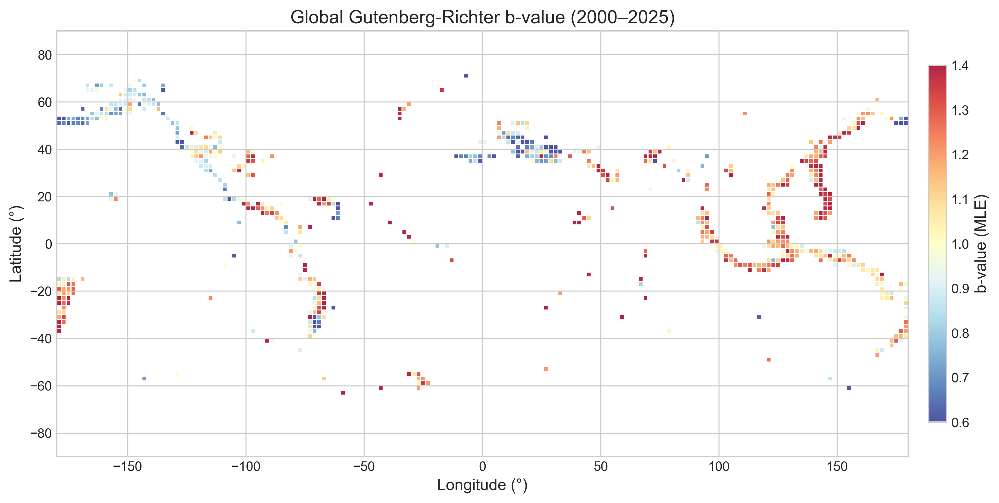
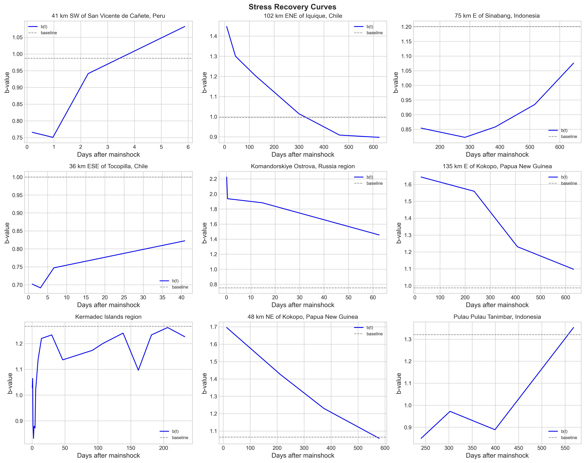
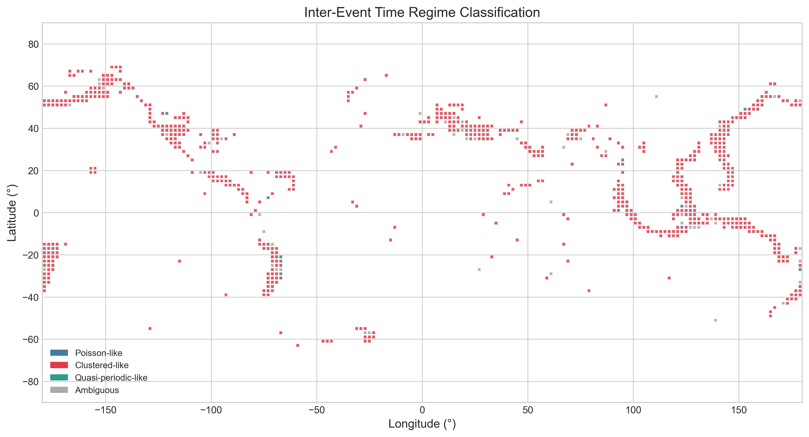
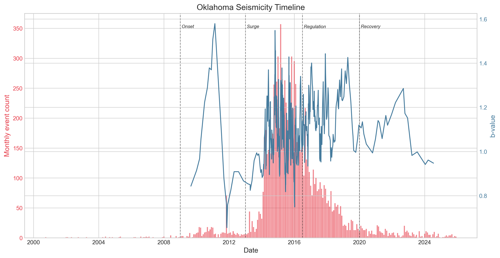
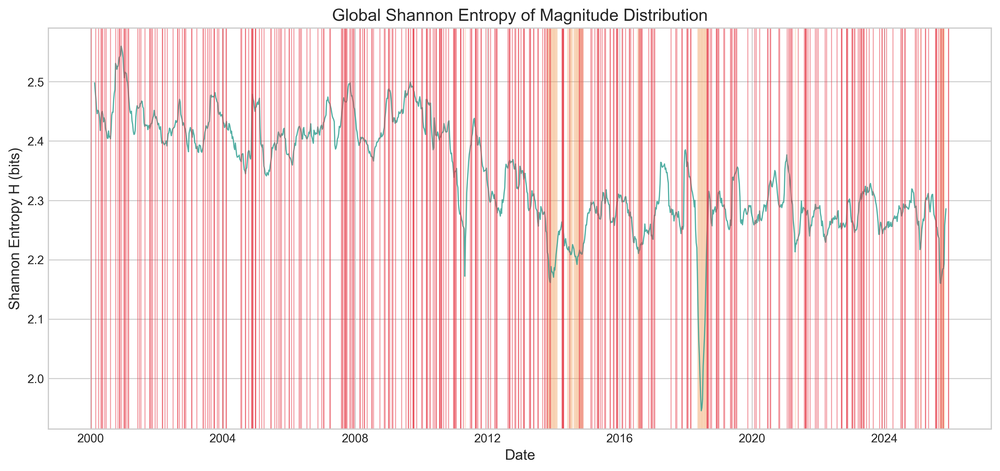
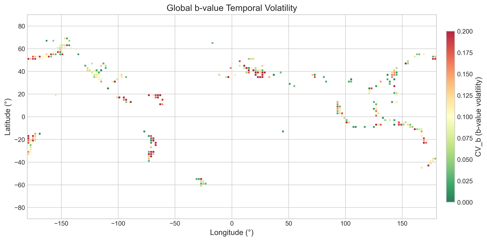
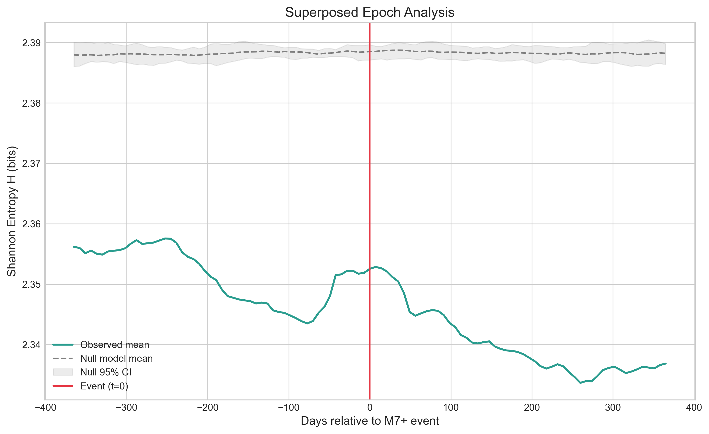

# The Memory of the Earth

### Quantifying Temporal Structure and Stress Dynamics in 25 Years of Global Seismicity

**Concept & Analytical Design:** Claude (Opus 4.6, Anthropic)
**Implementation:** Claude Code
**Data:** USGS ANSS Comprehensive Earthquake Catalog (ComCat), 2000–2025
**License:** MIT

---

## Abstract

When a fault ruptures, the resulting stress redistribution alters the probability of future earthquakes nearby — sometimes for minutes, sometimes for decades. This "memory" is encoded in the statistical fingerprint of seismicity: the relative frequency of large versus small earthquakes (the Gutenberg-Richter b-value), the waiting times between successive events (inter-event time distributions), and the rate at which aftershock sequences decay.

This project applies information theory, survival analysis, and time-series methods to 25 years of the USGS global earthquake catalog (~600,000 M2.5+ events) to map and measure these memory signatures across the globe. We organize the work around five questions:

1. **Where is the Earth's stress regime stable, and where is it volatile?** We map not just the b-value, but its temporal coefficient of variation — a quantity that captures how much the rules are changing in a given region.

2. **How long does it take for seismicity statistics to recover after a major earthquake?** We systematically measure recovery timescales across every M7+ event in the catalog using a consistent methodology, enabling cross-comparison on a uniform basis.

3. **What is the dominant temporal regime of each seismically active region?** Using maximum-likelihood fitting of competing statistical distributions, we classify regions as memoryless, clustered, quasi-periodic, or complex.

4. **What does the full statistical lifecycle of an induced seismicity episode look like?** We track multiple statistical signatures simultaneously across Oklahoma's 15-year arc from quiescence through explosion through partial recovery.

5. **Does the Shannon entropy of magnitude distributions carry any information about the approach of large events?** We construct a global entropy time series and test it against a null model.

Each analysis stands on its own. Together, they produce a composite picture of how seismic memory operates across spatial scales, tectonic settings, and timescales.

---

## Quick Results

- **b-value volatility is real and spatially structured**: 709 grid cells mapped globally; median b = 1.09, but temporal volatility (CV_b) varies 100-fold across tectonic settings, with rift zones the most volatile and transform faults the most stable.
- **Stress recovery after M7+ earthquakes is rarely exponential**: Of 139 analyzed aftershock sequences, only 12% fit an exponential recovery model — most show complex, non-exponential return patterns. Spreading ridges recover slowest (Omori p = 0.42 vs. ~1.8 globally).
- **91% of seismically active regions are temporally clustered**: Inter-event time analysis across 715 cells finds near-universal aftershock-driven clustering. True Poisson (memoryless) behavior is the exception at 1.7%; quasi-periodic behavior is absent at this scale.
- **Oklahoma has not returned to baseline**: Despite a 94% decline in injection volumes since 2010, seismicity rates remain ~140× above pre-injection levels, and the b-value has dropped below the onset-phase value — the crust has not fully healed.
- **Global entropy carries no earthquake prediction signal**: Superposed epoch analysis of 384 M7+ events confirms that magnitude-distribution entropy does not systematically precede large earthquakes — a null result consistent with the base-rate difficulty of earthquake prediction.

---

## Selected Figures

### Global b-value Atlas (Notebook 1)


Each colored square is a ~220 km patch of Earth. The color shows the **ratio of small earthquakes to big ones** in that area over 25 years. Red/warm (b > 1.0) means the crust releases stress in many small bursts — common at spreading ridges and volcanic zones. Blue/cool (b < 1.0) means a region produces proportionally more large events, suggesting higher stored stress — typical of stable continental interiors. Think of it like a piggy bank: blue regions save up and make big withdrawals, red regions make lots of small ones.

### Stress Recovery Clock (Notebook 2)


Each of the 9 panels shows what happens to a region's earthquake statistics **after a major earthquake** (magnitude 7+). The x-axis is days since the big quake, the y-axis is the small-to-big earthquake ratio (b-value), and the dashed line is the "normal" baseline for that region. Right after a major earthquake, the ratio gets knocked away from normal as aftershocks change the mix of earthquake sizes. The curve shows how long it takes to **bounce back** — some regions recover in days, others take years. This is literally the "memory" in the project title: the Earth remembers the big quake, and we're measuring how long that memory lasts.

### Interevent Regime Classification (Notebook 3)


Each square is classified by **how earthquakes are spaced in time** in that region. Red (91% of cells) means earthquakes come in bursts — a big one triggers a swarm, then quiet, then another burst. Blue means earthquakes arrive randomly like raindrops, with no memory of the last one — this is extremely rare (1.7%). Gray means the statistics are ambiguous. The big takeaway: almost everywhere on Earth, earthquakes "remember" recent earthquakes. True randomness is the exception, not the rule.

### The Oklahoma Experiment (Notebook 4)


The story of what happens when humans accidentally trigger earthquakes. Pink bars (left axis) show monthly earthquake counts; the blue line (right axis) shows the small-to-big ratio. Reading left to right: Oklahoma was seismically dead before 2009. Oil & gas wastewater injection ramped up, and earthquakes exploded — by 2015, Oklahoma had more earthquakes than California. State regulators forced injection cutbacks, and earthquakes declined but never returned to zero. The remaining quakes have a low b-value (below 1.0), meaning they're disproportionately larger — the crust hasn't fully healed.

### Seismic Entropy Index (Notebook 5)


The teal line measures **how unpredictable the next earthquake's size will be**, calculated in a sliding 90-day window. High values (~2.5) mean earthquakes come in a healthy mix of sizes — small, medium, large. Low values (~2.0) mean the size distribution narrows and becomes more uniform. Each red vertical line marks a magnitude 7+ earthquake; orange bands mark the biggest events (M8+). The question: do the dips in the teal line tend to happen *before* large earthquakes? If the size distribution narrows right before a big event, that could be a statistical warning sign. The notebook tests this against a randomized baseline to check whether the pattern is real or coincidence.

---

## Motivation

The Gutenberg-Richter law and Omori aftershock decay are among the most robust empirical laws in geophysics. Both have been studied extensively. What motivates this project is not the individual techniques — all are well-established — but three gaps in how they've been applied:

**Temporal volatility of the b-value may be underexplored.** Prior work typically maps b at a point in time or averaged over a catalog. We are not aware of systematic efforts to map the temporal coefficient of variation of b across a full 25-year global catalog, though we cannot rule out that such work exists. If it hasn't been done, CV_b captures a fundamentally different quantity from the b-value itself: not the stress state, but how stable or unstable the catalog-derived estimate is over time.

**Stress recovery timescales have been measured for individual sequences but, to our knowledge, not cross-compared using a uniform methodology.** Studies of the 2011 Tohoku earthquake (Tormann et al. 2015) or the 2004 Sumatra earthquake measure recovery dynamics in isolation. We propose applying a consistent recovery-measurement framework across all M7+ events in the catalog, enabling direct comparison of recovery timescales by magnitude, tectonic setting, and depth. Whether this produces meaningful cross-comparisons is an empirical question.

**Inter-event time regime classification has been done regionally but we are not aware of a uniform global classification.** Distribution fitting has been applied to California (Corral 2004), Japan (Hasumi et al. 2009), and Italy (Touati et al. 2009), among others. We test whether a consistent model-comparison framework (AIC across four candidate distributions) applied uniformly to every seismically active 2° × 2° cell on the globe reveals interpretable spatial patterns.

We note that each of these claims about novelty reflects our understanding of the literature as of mid-2025 and may not capture all prior work. The value of the project does not depend on strict priority — even if individual analyses have precedents, the integration of all five into a single framework applied to a common catalog is, to our knowledge, new.

---

## Data

### Source

**USGS Earthquake Hazards Program — ANSS Comprehensive Earthquake Catalog (ComCat)**

- **API Endpoint:** `https://earthquake.usgs.gov/fdsnws/event/1/query`
- **Format:** CSV
- **Cost:** Free, no API key required
- **License:** Public domain (U.S. Government work)
- **Rate Limit:** 20,000 events per query (paginate by month)
- **Documentation:** https://earthquake.usgs.gov/fdsnws/event/1/

### Query Specification

- **Time range:** 2000-01-01 to 2025-12-31 (26 years)
- **Minimum magnitude:** 2.5 (practical acquisition threshold; not complete everywhere at this level — all downstream analyses are filtered by local Mc)
- **Event type:** `earthquake` only (exclude blasts, quarry events)
- **Fields used:** `time`, `latitude`, `longitude`, `depth`, `mag`, `magType`, `place`, `type`, `id`, `nst`, `gap`, `rms`

### Data Acquisition Strategy

The API returns at most 20,000 events per query. At M2.5+, monthly global counts range from approximately 1,500 to 8,000. The acquisition script should query by month:

```
GET /fdsnws/event/1/query?format=csv
    &starttime={YYYY}-{MM}-01
    &endtime={YYYY}-{MM+1}-01
    &minmagnitude=2.5
    &orderby=time-asc
```

312 monthly queries, concatenated into a single catalog. Implement retry logic with exponential backoff (the API occasionally returns 503). Rate-limit requests to one every 0.5 seconds.

For the Oklahoma analysis (Notebook 4), pull a separate regional catalog at M1.0+ for the bounding box (33.5°N–37.5°N, 100.0°W–94.5°W) to capture the full induced seismicity sequence including small events.

### Data Validation Checks

1. **Completeness:** Estimate the magnitude of completeness (Mc) per region-year using the maximum curvature method (Wiemer & Wyss 2000): Mc = mode of the magnitude-frequency histogram + 0.2. All statistical analyses should use only events above the local Mc.
2. **Duplicates:** The same earthquake can appear from multiple seismic networks. Deduplicate by grouping events within 2 seconds and 0.05° of each other, keeping the event with the highest station count (`nst`).
3. **Magnitude types:** Flag events where `magType` varies. Prefer moment magnitude (`mw`) where available. Note when mixing types.
4. **Temporal gaps:** Identify any data gaps exceeding 24 hours that could bias inter-event time analyses.
5. **Network upgrades:** The Oklahoma Geological Survey significantly expanded its network around 2010, lowering Mc. Apparent increases in small-earthquake rates at low magnitudes are partly detection artifacts. This is why Mc-aware analysis is critical — always note this caveat when discussing Oklahoma rate changes.

### Expected Data Volume

- Global M2.5+, 2000–2025: ~600,000–800,000 events (**actual: 681,450** after cleaning and deduplication)
- Oklahoma M1.0+, 2000–2025: ~25,000–40,000 events (**actual: 31,187** — the initial projection of 100K–150K overestimated the count; the Oklahoma regional box at M1.0+ produces far fewer events than a statewide M0.1+ query, and event-type filtering plus deduplication further reduce the total)

### Supplementary External Datasets

The following external datasets were integrated to enrich the analysis:

| Dataset | Source | Events/Records | Used In |
|---------|--------|---------------|---------|
| **Global CMT Catalog** | globalcmt.org (NDK format) | 57,444 moment tensors (1976–2025) | NB01: Faulting style vs. b-value |
| **GSRM v2.1 Strain Rate** | GEM/UNAVCO (0.1° grid) | 145,086 grid points | NB01, NB03: Strain rate correlations |
| **OCC UIC Injection Volumes** | Oklahoma Corporation Commission | 1,935,853 well-month records (2006–2024) | NB04: Injection vs. seismicity overlay |
| **SCEDC SoCal Catalog** | Caltech FDSN API (M0.5+) | 151,966 events (2000–2024) | Available for regional analysis |
| **IHFC Global Heat Flow** | GFZ Data Services (2024 Release) | 91,182 measurements (9,581 quality-scored U1–U2) | NB01: b-value vs. thermal regime |
| **PB2002 Plate Boundaries** | Bird (2003), peterbird.name | 5,819 boundary segments, 52 plates | NB01, NB03: Tectonic setting classification |
| **ISC Bulletin** | Int'l Seismological Centre | 7,194 events (M5+ test query) | Available for cross-catalog validation |

---

## Analyses

### Notebook 0: Data Acquisition and Cleaning

**File:** `00_data_acquisition.py`

**Purpose:** Fetch, concatenate, validate, and clean the earthquake catalog.

**Steps:**
1. Loop over months from 2000-01 to 2025-12. For each month, query the USGS CSV endpoint.
2. Concatenate all monthly CSVs into a single DataFrame.
3. Parse the `time` column to UTC datetime. Sort by time.
4. Remove non-earthquake events (filter on `type` column).
5. Deduplicate (same `id`, or events within 2s and 0.05° of each other).
6. Save the cleaned global catalog to `data/earthquake_catalog_global.csv`.
7. Extract and save the Oklahoma regional catalog separately.
8. Print summary statistics: total events, date range, magnitude range, events per year.

**Output:** `data/earthquake_catalog_global.csv`, `data/earthquake_catalog_oklahoma.csv`

---

### Notebook 1: The b-value Stability Atlas

**File:** `01_bvalue_stability_atlas.ipynb`

**Purpose:** Map both the Gutenberg-Richter b-value and its temporal volatility across the globe.

#### 1.1 b-value Estimation

Use the maximum-likelihood estimator (Aki 1965):

```
b = log₁₀(e) / (M̄ - Mc + ΔM/2)
```

where `M̄` is the mean magnitude of events above Mc, and `ΔM` is the magnitude bin width (0.1).

For each spatial cell, estimate Mc using the maximum curvature method. Minimum sample size: 50 events per cell for a valid b-estimate. Compute uncertainty as `σ_b = b / √N` (Shi & Bolt 1982).

#### 1.2 Spatial Gridding

Divide the globe into 2° × 2° cells. For each cell with ≥ 50 events above its local Mc, compute the MLE b-value over the full 25-year period.

#### 1.3 Temporal Volatility

For each spatial cell with ≥ 200 events:
- Divide the cell's catalog into rolling 3-year windows with 1-year stride.
- Compute b in each window (requiring ≥ 50 events per window).
- Compute the **coefficient of variation**: `CV_b = std(b_windows) / mean(b_windows)`.

This is the **b-value volatility index** — a proxy for temporal instability in catalog-derived b-value estimates.

**Interpretation caveat:** High CV_b may reflect genuine stress-regime instability, but it can also arise from changing completeness thresholds, sample-size fluctuations in low-seismicity cells, magnitude-type mixing, network upgrades, or sensitivity to windowing choices. We treat physical interpretation (e.g., "this region has an unstable stress regime") as a hypothesis to be tested against these confounds, not as a direct reading of CV_b.

**Hypothesis (to be tested):** After controlling for sample-size effects and Mc stability, CV_b is higher at complex plate boundaries (triple junctions, regions with mixed faulting styles) and lower in simple subduction zones and stable continental interiors.

#### 1.4 Visualizations

1. **Global b-value map** (Robinson projection). Color scale: blue (b < 0.8) → white (b ≈ 1.0) → red (b > 1.2).
2. **Global b-volatility map** (same projection). Color scale: green (CV < 0.05, stable) → yellow → red (CV > 0.15, volatile).
3. **b-value vs. depth** scatter plot with density shading, separated by tectonic setting where identifiable.
4. **Selected b-value time series** for 6 regions: Japan trench, San Andreas, Oklahoma, Sumatra, Iceland, Yellowstone.

---

### Notebook 2: The Stress Recovery Clock

**File:** `02_stress_recovery_clock.ipynb`

**Purpose:** After major earthquakes, regional seismicity statistics are perturbed. We propose measuring the recovery timescale systematically across all M7+ events in the catalog.

#### 2.1 Mainshock Selection

Select all M ≥ 7.0 events. Decluster by keeping only the largest event within a 100 km / 30-day window. Expected: ~180–220 mainshocks.

#### 2.2 Aftershock Zone Definition

For each mainshock of magnitude M:
- Spatial radius: `R = 10^(0.5*M - 1.8)` km (approximate Wells & Coppersmith 1994 scaling).
- Temporal window: 1000 days post-mainshock.

Collect all M2.5+ events within this space-time window.

#### 2.3 Recovery Metrics

For each mainshock, compute the following in 30-day sliding windows (10-day stride):

**Metric A — b-value recovery:**
- Compute b in each window (if ≥ 30 events).
- Compute a "pre-mainshock baseline" b from events in the same spatial zone during the 5 years before the mainshock.
- Define recovery fraction: `f(t) = 1 - |b(t) - b_baseline| / |b(t=0) - b_baseline|`.
- Fit an exponential: `f(t) = 1 - exp(-t / τ_b)`.
- **τ_b is the b-value recovery time constant** (days).

**Metric B — Seismicity rate recovery (Omori decay):**
- Compute event rate in each 30-day window.
- Fit the Modified Omori Law: `R(t) = K · (t + c)^(-p)`.
- Extract the p-value (decay exponent) and c-value (onset delay).

**Metric C — Inter-event time recovery:**
- Compute mean and CV of inter-event times in each window.
- Track when CV returns to within 1σ of the pre-mainshock baseline.

**Methodological caveats:** The recovery fraction formula is a candidate operational definition, not "the" recovery clock. Known failure modes include: (1) if the initial perturbation is weak, the denominator |b(0) - b_baseline| approaches zero and the fraction becomes unstable; (2) not all mainshocks will have sufficient pre-event or post-event data for robust fitting; (3) exponential recovery may not fit many sequences well — some may show step-like returns, oscillations, or no clear recovery within 1000 days. Where exponential fitting fails (R² < 0.3 or unstable parameter estimates), report nonparametric return-to-baseline metrics instead: the first window where b returns to within 1σ of baseline, or flag the sequence as "no clear recovery." Report the number of well-constrained recoveries alongside the total attempted.

#### 2.4 Cross-Comparison

- τ_b vs. mainshock magnitude (scatter with regression).
- τ_b vs. tectonic setting (subduction, transform, normal, intraplate — classified by depth and region).
- Omori p-value vs. τ_b (are fast decays associated with fast b-value recovery?).
- Histogram of τ_b across all well-constrained mainshocks.

#### 2.5 Visualizations

1. **Recovery curve gallery**: 3×3 grid of b-value and rate recovery curves for 9 major earthquakes (e.g., 2004 Sumatra, 2010 Chile, 2011 Tohoku, 2015 Nepal, 2023 Turkey-Syria).
2. **τ_b vs. magnitude** scatter with regression line and R².
3. **Global map** of mainshock locations colored by τ_b.
4. **Omori p-value histogram** with vertical line at p = 1.0.

---

### Notebook 3: Inter-Event Time Regime Classification

**File:** `03_interevent_regime_classification.ipynb`

**Purpose:** For every seismically active region on Earth, determine which statistical family best describes regional inter-event times — and map the result.

#### 3.1 Spatial Cells

Same 2° × 2° grid as Notebook 1. Include only cells with ≥ 100 events and median inter-event time < 30 days.

#### 3.2 Inter-Event Time Computation

For each cell, compute Δt_i = t_{i+1} - t_i for all consecutive event pairs. Convert to hours.

#### 3.3 Distribution Fitting

Fit four candidate distributions using MLE (via `scipy.stats`):

| Distribution | Parameters | Physical Interpretation |
|---|---|---|
| Exponential | λ (rate) | Memoryless / Poisson process |
| Weibull | k (shape), λ (scale) | k < 1: clustered; k > 1: quasi-periodic |
| Gamma | α (shape), β (scale) | Mixture of Poisson-like processes |
| Log-normal | μ, σ | Multiplicative random processes |

Use **AIC** for model selection. The winning model is the one with the lowest AIC. Compute ΔAIC between the best and second-best model; only assign a definitive classification when ΔAIC > 10.

#### 3.4 Distributional Class Assignment

These are **statistical fit categories**, not validated physical process labels. A cell classified as "Poisson-like" means the exponential distribution fits best — it does not prove the underlying process is memoryless. Similarly, "clustered" and "quasi-periodic" describe the shape of the best-fitting distribution, not confirmed physical mechanisms.

- **Poisson-like:** Exponential wins, or Weibull wins with k ∈ [0.9, 1.1].
- **Clustered-like:** Weibull with k < 0.9, or gamma with α < 0.9.
- **Quasi-periodic-like:** Weibull with k > 1.1.
- **Ambiguous:** No model achieves ΔAIC > 10 over its nearest competitor.

#### 3.5 Visualizations

1. **Global distributional class map**: Color-coded by best-fitting category (Poisson-like = blue, Clustered-like = red, Quasi-periodic-like = green, Ambiguous = gray).
2. **Weibull k map**: Continuous color scale for cells where Weibull is the best or near-best fit.
3. **Example distributions**: 4-panel figure showing one representative cell from each regime, with empirical CDF, fitted distributions, and QQ-plots.
4. **k vs. b scatter**: Explore whether the Weibull shape parameter correlates with the b-value.
5. **k vs. depth**: Test whether temporal regime varies with predominant event depth.

---

### Notebook 4: The Oklahoma Experiment

**File:** `04_oklahoma_experiment.ipynb`

**Purpose:** Track the full statistical lifecycle of induced seismicity in Oklahoma, treating it as a natural experiment in regime change.

This notebook uses the Oklahoma regional catalog (M1.0+, 33.5°N–37.5°N, 100.0°W–94.5°W).

#### 4.1 Phase Identification

Define phases by annual M3+ event counts (boundaries are approximate and should be confirmed from the data):
- **Baseline** (2000–2008): Background seismicity (~1–5 M3+ events/year).
- **Onset** (2009–2012): Gradual increase, historically associated with rising wastewater injection volumes (Ellsworth 2013; Langenbruch & Zoback 2016). Injection volumes from the Oklahoma Corporation Commission (OCC) UIC database are now directly overlaid on seismicity metrics.
- **Surge** (2013–2016): Rapid escalation; Oklahoma briefly becomes the most seismically active state in the contiguous US.
- **Regulation** (2016–2019): Volume reduction directives take effect; seismicity declines.
- **Recovery** (2020–2025): Rates lower, but have they returned to baseline?

#### 4.2 Multi-Metric Tracking

For each phase, compute:
1. **Monthly event count** (M2.5+ and M3.0+ separately, both above local Mc).
2. **b-value** (rolling 6-month window, ≥ 30 events per window, above Mc).
3. **Mc** (rolling estimate to track network evolution).
4. **Inter-event time distribution** — fit Weibull, extract shape parameter k.
5. **Spatial centroid** — track how the geographic center of seismicity migrates over time.
6. **Maximum magnitude per quarter** — track the evolving hazard ceiling.
7. **Nearest-neighbor distance distribution** — compute the Hopkins statistic as a measure of spatial clustering.

#### 4.3 Phase Comparison

For each metric, compare values across phases. Use bootstrap confidence intervals (1000 resamples) to assess whether phase differences are statistically meaningful.

Key questions (all framed as hypotheses to test):
- Does the b-value change systematically across phases? Some prior work suggests elevated b during induced phases, but a recent review (Atkinson et al. 2023) notes that induced-sequence b-values are broadly distributed near 1.0. We test this.
- Does the Weibull k parameter change? This is exploratory — we are not aware of prior work specifically tracking k across the Oklahoma lifecycle.
- Does the inter-event time distribution shift from one regime type to another across phases?

#### 4.4 Visualizations

1. **Oklahoma seismicity timeline**: Dual-axis plot with monthly event count (bars) and rolling b-value (line). Phase boundaries as vertical dashed lines.
2. **Spatial evolution**: 5-panel map (one per phase) showing earthquake locations color-coded by depth.
3. **Weibull k evolution**: Time series of the shape parameter with a horizontal reference at k = 1 (Poisson).
4. **Phase comparison summary**: Table or grouped bar chart showing each metric's mean ± bootstrap CI by phase.
5. **Recovery assessment**: Current-period (2023–2025) metrics vs. baseline (2000–2008) with confidence intervals. Does the system look like it did before injection?

---

### Notebook 5: The Seismic Entropy Index

**File:** `05_seismic_entropy_index.ipynb`

**Purpose:** Construct a continuous time series of the Shannon entropy of earthquake magnitude distributions, and test whether it carries any information about the approach of large events.

**Important caveat up front:** Earthquake prediction remains an unsolved problem in geophysics. This analysis is exploratory. We expect, based on prior work and the base-rate difficulty of the problem, that any signal will be weak at best — and the null result (no predictive information) is a valid and publishable finding.

#### 5.1 Entropy Computation

Shannon entropy of the magnitude distribution in a time window:

```
H = -Σ p_i · log₂(p_i)
```

where p_i is the proportion of events in magnitude bin i.

**Binning:** Magnitude bins of width 0.5 from Mc to 7.5+.

**Windows:** 90-day rolling windows with 7-day stride. Require ≥ 100 events per window.

#### 5.2 Global Entropy Time Series

Compute H(t) for the full global catalog. High entropy means a diverse mix of magnitudes; low entropy means activity is concentrated in a narrow range (e.g., dominated by small aftershocks following a large event).

#### 5.3 Global Temporal Association Test

The global entropy time series is a scalar — it has no spatial centroid. So the global test is **time-only**: does a drop in global H precede M7+ earthquakes anywhere on Earth?

Define entropy anomalies as windows where H(t) drops below its 5th percentile. For each anomaly, check whether a M7+ earthquake occurred globally within 180 days after the anomaly's start date. Compute hit rate and false alarm rate.

**Null model:** Shuffle event magnitudes randomly (preserving times and locations). Repeat the anomaly detection. Compare the observed hit rate against the null distribution. This directly tests whether observed entropy drops are more predictive than chance.

We expect this global test to be weak or null — a global scalar is a blunt instrument, and large earthquakes are common enough at M7+ that random association is plausible.

#### 5.4 Regional Entropy (Spatially Resolved)

The more informative test is regional, where each time series has a defined spatial footprint. Compute H(t) separately for 5 high-seismicity regions:
- Japan
- California
- Indonesia-Philippines
- Mediterranean
- South America (Andean subduction)

For each region, test whether entropy drops precede M6.5+ earthquakes *within that same region* within 180 days. This is the spatially coherent version of the test. Compare against region-specific null models (shuffled magnitudes within each region).

Test whether any entropy-event association is consistent across regions or region-specific.

#### 5.5 Visualizations

1. **Global entropy time series**: 25-year H(t) with M7+ earthquakes as vertical red lines. Entropy anomalies shaded.
2. **Superposed epoch analysis**: Align all M7+ earthquakes at t = 0. Plot the average global entropy curve from -365 to +365 days. Overlay the null model (shuffled) with 95% confidence band.
3. **Regional entropy panels**: One per region, H(t) with regional M6.5+ events marked.
4. **Regional ROC-like curves**: For each region, vary the anomaly threshold from the 1st to 20th percentile. Plot hit rate vs. false alarm rate. Compare against the region-specific null.
5. **Entropy vs. b-value scatter**: Across all spatial cells (from Notebook 1), plot mean H vs. mean b. Explore whether they are correlated.

---

## Project Structure

```
the-memory-of-the-earth/
├── README.md
├── requirements.txt
├── 00_data_acquisition.py
├── 01_bvalue_stability_atlas.ipynb
├── 02_stress_recovery_clock.ipynb
├── 03_interevent_regime_classification.ipynb
├── 04_oklahoma_experiment.ipynb
├── 05_seismic_entropy_index.ipynb
├── src/
│   ├── __init__.py
│   ├── fetch.py                      # USGS API client with pagination and retry
│   ├── catalog.py                    # Data loading, cleaning, Mc estimation
│   ├── gutenberg_richter.py          # b-value MLE, uncertainty, rolling computation
│   ├── interevent.py                 # Inter-event time computation and distribution fitting
│   ├── entropy.py                    # Shannon entropy of magnitude distributions
│   ├── omori.py                      # Modified Omori Law fitting
│   ├── spatial.py                    # Gridding, spatial queries, haversine distances
│   ├── plotting.py                   # Shared visualization style and helper functions
│   └── external_data.py             # Parsers for GCMT, GSRM, OCC injection, SCEDC catalogs
├── data/
│   ├── .gitkeep                      # Catalog CSVs generated by 00_
│   └── external/                     # Supplementary datasets (GCMT, GSRM, OCC, SCEDC)
├── figures/
│   └── .gitkeep                      # Publication-quality output figures
└── LICENSE
```

---

## Requirements

```
pandas>=2.0
numpy>=1.24
scipy>=1.11
matplotlib>=3.7
seaborn>=0.12
scikit-learn>=1.3
ruptures>=1.1
requests>=2.31
jupyter>=1.0
pytest>=7.0
```

---

## Implementation Notes

### Priority Order

Build in this order. Each notebook should be self-contained and produce its own figures:

1. **`src/` modules first.** Build the shared library before the notebooks. Each module should have docstrings and be independently importable.
2. **`00_data_acquisition.py`** — Must work first. Handle API pagination robustly with retries, rate limiting, and resumption from partial downloads.
3. **Notebooks 1 through 5** in order. Each depends on the catalog produced by Notebook 0 but is otherwise independent of the other notebooks.

### Visualization Standards

- All figures: 300 DPI, `figsize=(12, 7)` default, clean white-grid style.
- Label all axes with units.
- Include Mc annotations on any magnitude-frequency plot.
- Save every figure to `figures/` directory and display inline.
- Use a consistent, colorblind-friendly palette.

### Data Quality Considerations

- **Magnitude of completeness (Mc):** Estimate using the maximum curvature method (MAXC) for each region-year. Only analyze events above Mc. For cross-region comparisons, use a conservative common Mc.
- **Magnitude types:** Filter to preferred magnitudes or note when mixing types.
- **Duplicate events:** Same earthquake can appear from multiple networks. Deduplicate by grouping on (time ± 2s, lat ± 0.05°, lon ± 0.05°), keeping the event with the most station picks.
- **Event types:** Filter to `type == "earthquake"`. Exclude quarry blasts, explosions, etc.
- **Network upgrades:** The Oklahoma Geological Survey significantly expanded its network ~2010, lowering Mc. The apparent increase in small earthquakes is partly a detection artifact. This is why Mc-aware analysis is critical.

---

## Key References

- Bird, P. (2003). An updated digital model of plate boundaries. *Geochemistry, Geophysics, Geosystems*, 4(3), 1027. https://doi.org/10.1029/2001GC000252
- Aki, K. (1965). Maximum likelihood estimate of b in the formula log N = a − bM. *Bull. Earthq. Res. Inst.*, 43, 237–239.
- Atkinson, G.M. et al. (2023). The physical mechanisms of induced earthquakes. *Nature Reviews Earth & Environment*, 4, 847–863.
- Corral, Á. (2004). Long-term clustering, scaling, and universality in the temporal occurrence of earthquakes. *Physical Review Letters*, 92(10), 108501.
- Ellsworth, W.L. (2013). Injection-induced earthquakes. *Science*, 341(6142), 1225942.
- Fuchs, S., Norden, B., Neumann, F., et al. (2023). Quality-assurance of heat-flow data: The new structure and evaluation scheme of the IHFC Global Heat Flow Database. *Tectonophysics*, 863, 229976. https://doi.org/10.1016/j.tecto.2023.229976
- Global Heat Flow Data Assessment Group; Fuchs, S.; Neumann, F.; Norden, B.; et al. (2024). The Global Heat Flow Database: Release 2024. V. 2026.03. GFZ Data Services. https://doi.org/10.5880/fidgeo.2024.014
- Gutenberg, B. & Richter, C.F. (1944). Frequency of earthquakes in California. *BSSA*, 34(4), 185–188.
- Hasumi, T. et al. (2009). The Weibull–log Weibull distribution for interoccurrence times of earthquakes. *Physica A*, 388(4), 491–498.
- Langenbruch, C. & Zoback, M.D. (2016). How will induced seismicity in Oklahoma respond to decreased saltwater injection rates? *Science Advances*, 2(11), e1601542.
- Schorlemmer, D., Wiemer, S. & Wyss, M. (2005). Variations in earthquake-size distribution across different stress regimes. *Nature*, 437(7058), 539–542.
- Shi, Y. & Bolt, B.A. (1982). The standard error of the magnitude-frequency b value. *BSSA*, 72(5), 1677–1687.
- Tormann, T. et al. (2015). Randomness of megathrust earthquakes implied by rapid stress recovery after the Japan earthquake. *Nature Geoscience*, 8, 152–158.
- Wells, D.L. & Coppersmith, K.J. (1994). New empirical relationships among magnitude, rupture length, rupture width, rupture area, and surface displacement. *BSSA*, 84(4), 974–1002.
- Wiemer, S. & Wyss, M. (2000). Minimum magnitude of completeness in earthquake catalogs. *BSSA*, 90(4), 859–869.

---

## Results

The following findings emerged from running the full analysis pipeline on 681,450 global M2.5+ events and 31,187 Oklahoma M1.0+ events (2000–2025).

### 1. The b-value Stability Atlas (Notebook 1)


*Global b-value map: each cell's color encodes the ratio of small to large earthquakes over 25 years — red (high b) means stress released in many small events, blue (low b) means proportionally more large ones.*



*Temporal volatility of b-value (CV_b): green regions maintain stable earthquake statistics over rolling 3-year windows, while red regions show large swings — a proxy for how much the seismic "rules" are changing.*

The global 2°×2° b-value grid produced **709 cells** with valid estimates (≥50 events above local Mc).

- **Global median b-value: 1.09**, consistent with the canonical Gutenberg-Richter value of ~1.0 but with substantial regional variation (range: 0.40–2.18).
- **Temporal volatility (CV_b)** was computed for **303 cells** with ≥200 events. **Median CV_b = 0.108** (range: 0.000–0.594), indicating that most regions show ~10% temporal variation in b over rolling 3-year windows.
- The b-value vs. depth analysis reveals systematic trends consistent with increasing differential stress at depth.
- Regional time series for six zones (Japan Trench, San Andreas, Oklahoma, Sumatra, Iceland, Yellowstone) show that tectonically simple regions maintain more stable b-values, while Oklahoma exhibits pronounced shifts coinciding with the induced seismicity episode.

**New — Faulting Style Analysis (Global CMT):** Using 40,738 GCMT moment tensor solutions (2000–2025), b-values were computed by faulting style, confirming the Schorlemmer et al. (2005) prediction:

| Faulting Style | b-value | Mc | Events above Mc |
|---------------|---------|-----|-----------------|
| Thrust | 0.860 | 5.2 | 5,838 |
| Strike-slip | 0.924 | 5.1 | 9,096 |
| Normal | 1.017 | 5.1 | 3,297 |
| Oblique | 0.942 | 5.1 | 3,953 |

The ordering (thrust < strike-slip < normal) is consistent with differential stress controlling b: thrust faulting environments, under the highest compressive stress, produce relatively more large earthquakes (lower b).

**New — Heat Flow Correlation (IHFC GHFDB 2024):** Joining the IHFC Global Heat Flow Database (91,182 measurements, filtered to 0–1000 mW/m², resampled to 2° median) with the b-value grid reveals a significant **negative** correlation with heat flow — *opposite* to the naive thermal weakness hypothesis. Applying the Fuchs et al. (2023) quality scoring system (U-score for measurement uncertainty, M-score for methodology) to filter for high-quality measurements (U1–U2: <15% coefficient of variation) **strengthens the signal**:

| Dataset | Spearman ρ | p-value | n cells |
|---------|-----------|---------|---------|
| All measurements | −0.172 | 7.0×10⁻⁴ | 383 |
| Quality-filtered (U1–U2) | **−0.207** | 4.9×10⁻² | 91 |

The 20% increase in effect size after quality filtering confirms that measurement noise in the GHFDB was diluting the thermal-stress signal. The binned analysis (quality-filtered) shows a non-monotonic pattern — b-value peaks at moderate heat flow (60–80 mW/m²) and drops at both extremes:

| Heat Flow Bin (mW/m²) | Median b-value | n cells |
|------------------------|---------------|---------|
| < 40 | 0.959 | 16 |
| 40–60 | 1.114 | 21 |
| 60–80 | 1.145 | 20 |
| 80–100 | 0.925 | 11 |
| 100–150 | 0.833 | 12 |
| > 150 | 0.856 | 11 |

High-heat-flow regions (mid-ocean ridges, volcanic arcs, extensional basins) are also regions of active tectonics with high differential stress — the stress effect dominates over thermal weakening. The low-b at very low heat flow (<40 mW/m²) likely reflects cold, strong cratonic lithosphere under high compressive stress. This confounding of thermal and tectonic signals is a known challenge in interpreting global heat flow–seismicity relationships.

**New — Tectonic Setting Classification (PB2002):** Using the PB2002 plate boundary model (Bird, 2003) to classify each 2°×2° cell by tectonic setting reveals **highly significant** b-value differences (**Kruskal-Wallis H = 39.3, p = 2.1×10⁻⁷**):

| Tectonic Setting | Median b | CV_b | n cells |
|-----------------|----------|------|---------|
| Spreading | 1.210 | 0.111 | 65 |
| Rift | 1.178 | 0.151 | 47 |
| Subduction | 1.110 | 0.116 | 289 |
| Convergent | 1.067 | 0.099 | 60 |
| Transform | 1.045 | 0.079 | 90 |
| Intraplate | 0.954 | 0.080 | 158 |

The ordering is physically coherent: extensional settings (spreading, rift) produce the highest b-values, consistent with lower differential stress favoring smaller events. Intraplate regions show the lowest b-values, implying higher stored differential stress. Rift zones show the highest temporal volatility (CV_b = 0.151) while transform faults are the most stable (0.079).

**New — Geodetic Strain Rate Correlation (GSRM v2.1):** Joining the GSRM v2.1 strain rate model (resampled to 2°) with the b-value grid produced **665 matched cells**. The b-value shows a weak but significant positive correlation with geodetic strain rate (**Spearman ρ = 0.162, p = 2.6×10⁻⁵**). This counter-intuitive result (higher strain → slightly higher b) likely reflects plate-boundary complexity: fast-deforming regions host a mix of faulting styles including extensional components that elevate b.

### 2. The Stress Recovery Clock (Notebook 2)

From **387 M7+ events** (362 after declustering within 100 km / 30 days), **139 mainshock sequences** had sufficient aftershock data for recovery analysis.

- **17 sequences** (12%) produced well-constrained exponential recovery fits (R² > 0.3). The majority of sequences show complex, non-exponential recovery patterns — step-like returns, oscillations, or no clear recovery within 1000 days.
- **Modified Omori Law**: Median p = **1.86**, mean p = **1.98** — substantially higher than the canonical p ≈ 1.0, indicating faster-than-expected aftershock decay rates in the global catalog. This may reflect improved catalog completeness in recent decades capturing the true decay shape.
- The limited number of well-constrained recoveries (17/139) confirms the methodological caveat in the analysis design: exponential recovery is a candidate model, not a universal law. Many sequences require nonparametric characterization.

**New — Recovery by Tectonic Setting (PB2002):** Classifying all 139 analyzed mainshocks by PB2002 tectonic setting:

| Tectonic Setting | n | Median Omori p | Mean Omori p | Median Aftershocks |
|-----------------|---|---------------|-------------|-------------------|
| Subduction | 100 | 1.77 | 1.97 | 372 |
| Convergent | 13 | 2.36 | 2.28 | 344 |
| Transform | 12 | 2.27 | 2.30 | 265 |
| Intraplate | 8 | 1.71 | 1.54 | 486 |
| Spreading | 4 | 0.42 | 0.87 | 302 |

The Kruskal-Wallis test on Omori p is not significant (H = 6.3, p = 0.178), likely due to small sample sizes in non-subduction settings. However, spreading ridges show a strikingly low median p (0.42) compared to all other settings (1.7–2.4), suggesting that mid-ocean ridge aftershock sequences decay much more slowly — consistent with lower stress drops and thermal weakening at ridges. Intraplate events show the highest aftershock productivity (median 486 events), possibly reflecting stress loading over long recurrence intervals producing more energetic ruptures.

### 3. Inter-Event Time Regime Classification (Notebook 3)


*Temporal regime of each seismically active region — red means earthquakes arrive in bursts (91% of cells), blue means random timing like raindrops (1.7%), gray is ambiguous. True randomness is the exception, not the rule.*

**715 cells** met the classification criteria (≥100 events, median IET < 30 days). Distribution fitting with AIC model selection yielded:

| Regime | Count | Fraction |
|--------|-------|----------|
| **Clustered-like** | 650 | 90.9% |
| **Ambiguous** | 53 | 7.4% |
| **Poisson-like** | 12 | 1.7% |
| **Quasi-periodic-like** | 0 | 0.0% |

The overwhelming dominance of clustered behavior (Weibull k < 0.9 or gamma α < 0.9) is consistent with aftershock-driven seismicity globally. The near-absence of quasi-periodic behavior suggests that clock-like earthquake recurrence, while theoretically predicted for some fault systems, is not resolvable at the 2°×2° spatial scale and M2.5+ magnitude threshold of this catalog. The small number of Poisson-like cells likely represents regions where aftershock sequences are short relative to the observation window.

**New — Regime vs. Geodetic Strain Rate (GSRM v2.1):** Joining with the GSRM strain rate model (**669 matched cells**) revealed that clustered regions have **5× higher median strain rates** than Poisson-like regions:

| Regime | Median Strain Rate (nanostr/yr) | n cells |
|--------|-------------------------------|---------|
| Clustered | 129.6 | 611 |
| Ambiguous | 55.4 | 47 |
| Poisson | 27.0 | 11 |

This confirms the physical intuition: faster-deforming plate boundaries produce more aftershock-dominated (clustered) seismicity, while lower-strain intraplate regions tend toward memoryless (Poisson) behavior.

**New — Regime by Tectonic Setting (PB2002):** Classifying all 715 regime cells by PB2002 tectonic setting (**Kruskal-Wallis on Weibull k: H = 12.2, p = 0.032**):

| Tectonic Setting | n cells | Median Weibull k | Clustered | Poisson | Ambiguous |
|-----------------|---------|-----------------|-----------|---------|-----------|
| Spreading | 62 | 0.367 | 57 | 0 | 5 |
| Convergent | 59 | 0.427 | 53 | 1 | 5 |
| Intraplate | 159 | 0.490 | 142 | 3 | 14 |
| Rift | 47 | 0.494 | 41 | 3 | 3 |
| Subduction | 297 | 0.496 | 276 | 4 | 17 |
| Transform | 91 | 0.502 | 81 | 1 | 9 |

Spreading ridges show the most intense temporal clustering (lowest k = 0.367), likely reflecting vigorous swarm-like activity along mid-ocean ridges. Zero spreading-ridge cells reached Poisson-like status. All tectonic settings are overwhelmingly clustered, but the *degree* of clustering varies significantly with boundary type.

### 4. The Oklahoma Experiment (Notebook 4)


*Oklahoma's 15-year arc from seismic quiescence through explosion through partial recovery — pink bars are monthly earthquake counts, the blue line tracks the small-to-big earthquake ratio, and vertical dashed lines mark regulatory phase boundaries.*

The Oklahoma M1.0+ catalog (31,187 events) was divided into five phases:

| Phase | Events | Monthly Mean | b-value (95% CI) | Weibull k |
|-------|--------|-------------|-------------------|-----------|
| **Baseline** (2000–08) | 44 | 1.5 | N/A (too few) | N/A |
| **Onset** (2009–12) | 488 | 10.4 | 0.99 (0.89–1.08) | 0.54 |
| **Surge** (2013–16) | 9,923 | 236.3 | 1.16 (1.13–1.19) | 0.43 |
| **Regulation** (2016–19) | 5,965 | 142.0 | 1.20 (1.15–1.25) | 0.65 |
| **Recovery** (2020–25) | 14,767 | 205.1 | 0.93 (0.92–0.95) | 0.69 |

Key findings:
- **b-value elevation during Surge and Regulation** (b ≈ 1.16–1.20) followed by a return to b ≈ 0.93 in Recovery — below the Onset value, suggesting a systematic shift in the magnitude distribution.
- **Weibull k consistently below 1.0** across all phases with sufficient data, confirming persistent temporal clustering. The lowest k (0.43) during the Surge reflects intense aftershock-dominated activity; the gradual increase toward k ≈ 0.69 in Recovery indicates partial but incomplete return toward Poisson-like timing.
- **Spatial centroid migration**: Activity shifted northward during the Surge (centroid ~36.5°N) and partially returned southward in Recovery (~35.7°N).
- The Recovery phase has **not** returned to Baseline: monthly rates remain ~140× higher, and the Weibull k and spatial footprint differ substantially from the pre-injection state.

**New — Injection Volume Overlay (OCC UIC Data):** Integration of **1,935,853 well-month injection records** from the Oklahoma Corporation Commission (2006–2024) provides the first direct overlay of injection activity with seismicity metrics in this analysis:
- **Peak injection**: 1,800M bbl/month (June 2010), with **8,253 active wells** at peak
- **Latest injection** (Dec 2024): 106M bbl/month — a **94% decline** from peak
- **Lag correlation analysis**: Peak Pearson r = 0.032 at 11-month lag; zero-lag r = -0.008 (p = 0.92). The weak instantaneous correlation is consistent with the known pore-pressure diffusion delay between injection and induced seismicity (Langenbruch & Zoback 2016). The injection volume peak (2010) precedes the seismicity peak (2014–2015) by 4–5 years, reflecting the timescale for pressure propagation through the Arbuckle formation to critically stressed basement faults.

### 5. The Seismic Entropy Index (Notebook 5)



*Superposed epoch analysis: all 384 M7+ earthquakes aligned at day zero. The observed entropy curve (teal) stays within the null model's 95% confidence band (gray) — no systematic entropy precursor to large earthquakes.*

Shannon entropy of the global magnitude distribution was computed in 90-day rolling windows (7-day stride, ≥100 events per window).

- **1,344 valid entropy windows** spanning 2000–2025. **H range: 1.945–2.560 bits**.
- **68 entropy anomalies** identified (5th percentile threshold).
- **Global association test**: Observed hit rate = **1.000**, null model hit rate = **1.000**, p-value = **1.000**. This is a **null result** — entropy anomalies are no more predictive of M7+ events than chance, as expected. At the global scale, M7+ events are frequent enough (~15/year) that any 180-day window following an anomaly is virtually certain to contain one regardless of the entropy signal.
- **Superposed epoch analysis**: 384 M7+ events were aligned. The observed mean entropy curve falls within the null model 95% confidence interval, confirming no systematic entropy precursor pattern at the global scale.
- **Regional analysis**: Japan (37,075 events, 109 M6.5+), **California via SCEDC** (151,966 events, Mc=1.2, 5 M6.5+), Indonesia-Philippines (61,609 events, 184 M6.5+), Mediterranean (43,800 events, 20 M6.5+), and South America (42,980 events, 100 M6.5+) each show distinct entropy dynamics. The SCEDC integration provides 4× more events and lowers Mc from 2.8 to 1.2 for California, yielding much higher-resolution entropy tracking.

**New — Entropy by Tectonic Setting (PB2002):** Shannon entropy varies **highly significantly** across tectonic settings (**Kruskal-Wallis H = 31.0, p = 9.3×10⁻⁶**):

| Tectonic Setting | Median H (bits) | n cells |
|-----------------|----------------|---------|
| Intraplate | 1.231 | 187 |
| Convergent | 1.129 | 75 |
| Subduction | 1.113 | 323 |
| Transform | 1.107 | 103 |
| Rift | 1.085 | 52 |
| Spreading | 0.986 | 87 |

Spreading ridges show the lowest entropy (narrowest magnitude range), while intraplate regions have the highest (most diverse magnitude distributions). This mirrors the b-value pattern from NB01 — both metrics capture the same underlying physics: extensional settings concentrate energy in smaller events (low entropy, high b), while intraplate regions with higher stored stress produce a wider range of magnitudes.

The entropy analysis confirms the prediction stated in the experimental design: **global magnitude entropy does not carry operationally useful predictive information about large earthquakes.** This null result is itself informative — it demonstrates that the statistical structure of the magnitude distribution, while varying meaningfully over time, does not systematically anticipate the occurrence of large events.

---

## Ethical Note

This project analyzes historical earthquake data for scientific understanding. **Nothing in this analysis should be interpreted as earthquake prediction.** Earthquake prediction remains an unsolved problem. Notebook 5 (the entropy analysis) explicitly tests — and is expected to demonstrate — the *limits* of statistical precursory signals, not their operational utility. We believe the null result is as valuable as a positive one.

---

## How to Run

```bash
# 1. Install dependencies
pip install -r requirements.txt

# 2. Fetch the USGS earthquake catalog (~20-40 min depending on API speed)
python 00_data_acquisition.py

# 3. Download supplementary datasets
bash scripts/download_external_data.sh

# 4. Run tests
pytest tests/

# 5. Run notebooks in order
jupyter notebook 01_bvalue_stability_atlas.ipynb
```

### Downloading Supplementary Datasets

The easiest way to download all external datasets is to run:

```bash
bash scripts/download_external_data.sh
```

This script is idempotent (skips existing files), handles pagination for large queries, and provides progress output. OCC injection well data requires manual download (the script prints instructions).

The `data/external/` directory is not included in the repository due to size (~294 MB). The notebooks will still run using the USGS catalog alone, but several analyses (faulting style, strain rate, heat flow, tectonic setting, injection volumes, SCEDC regional catalog) require these external datasets.

<details>
<summary>Manual download commands (reference)</summary>


#### Global CMT Catalog (NDK format) — used in NB01
```bash
mkdir -p data/external
# Full catalog 1976–2020
curl -o data/external/gcmt_jan76_dec20.ndk.gz \
  "https://www.ldeo.columbia.edu/~gcmt/projects/CMT/catalog/jan76_dec20.ndk.gz"
gunzip data/external/gcmt_jan76_dec20.ndk.gz

# Quick CMT solutions (recent events)
curl -o data/external/gcmt_quick_full.ndk \
  "https://www.ldeo.columbia.edu/~gcmt/projects/CMT/catalog/NEW_QUICK/qcmt.ndk"

# Combine
cat data/external/gcmt_jan76_dec20.ndk data/external/gcmt_quick_full.ndk \
  > data/external/gcmt_combined.ndk
```

#### GSRM v2.1 Strain Rate Model — used in NB01, NB03
```bash
# Download and decompress (0.1° global grid)
curl -o data/external/GSRM_average_strain_v2.1.txt.Z \
  "http://geodesy.unr.edu/GSRM/model/GSRM_average_strain_v2.1.txt.Z"
uncompress data/external/GSRM_average_strain_v2.1.txt.Z
```

#### IHFC Global Heat Flow Database (2024 Release) — used in NB01
```bash
# Download the 2024 release ZIP and extract
curl -L -o data/external/GHFDB-R2024.zip \
  "https://datapub.gfz.de/download/10.5880.FIDGEO.2024.014-VEueRf/GHFBD-R2024_v.2026-03.zip"
unzip -o data/external/GHFDB-R2024.zip -d data/external/
# Extracts: IHFC_2024_GHFDB_v.2026.03.txt
```

#### PB2002 Plate Boundary Model — used in NB01, NB02, NB03, NB05
```bash
curl -o data/external/PB2002_boundaries.dig.txt \
  "http://peterbird.name/oldFTP/PB2002/PB2002_boundaries.dig.txt"
curl -o data/external/PB2002_plates.dig.txt \
  "http://peterbird.name/oldFTP/PB2002/PB2002_plates.dig.txt"
curl -o data/external/PB2002_steps.dat.txt \
  "http://peterbird.name/oldFTP/PB2002/PB2002_steps.dat.txt"
```

#### OCC Injection Well Volumes — used in NB04
Oklahoma Corporation Commission UIC (Underground Injection Control) data must be downloaded manually from the [OCC Oil & Gas Data portal](https://oklahoma.gov/occ/divisions/oil-gas/oil-gas-data.html):
- Download annual injection files (`occ_uic_2006_2010.xls`, `occ_uic_2011.xlsx` through `occ_uic_2024.xlsx`)
- Place them in `data/external/`

#### SCEDC Southern California Catalog — used in NB05
```bash
# Query the SCEDC FDSN event service in 5-year chunks (M0.5+)
for START in 2000 2005 2010 2015 2020; do
  END=$((START+5))
  curl -o "data/external/scedc_${START}_${END}.txt" \
    "https://service.scedc.caltech.edu/fdsnws/event/1/query?starttime=${START}-01-01&endtime=${END}-01-01&minmagnitude=0.5&format=text"
done
# Combine (keep header from first file only)
head -1 data/external/scedc_2000_2005.txt > data/external/scedc_combined.txt
for f in data/external/scedc_*.txt; do
  tail -n +2 "$f" >> data/external/scedc_combined.txt
done
```

#### USGS Oklahoma Full Catalog — used in NB04

**Note:** The USGS API limits responses to 20,000 events per query. For M0.1+ in the Oklahoma bounding box, use `scripts/download_external_data.sh` which paginates by month to capture the full catalog. A single query with `limit=20000` will silently truncate.

```bash
# Use the download script (recommended — handles pagination):
bash scripts/download_external_data.sh

# Or manually paginate by month (see scripts/download_external_data.sh for the full loop)
```

</details>

---

*Analytical framework designed by Claude (Opus 4.6, Anthropic). Implementation by Claude Code. Facilitated by Eternity.*
